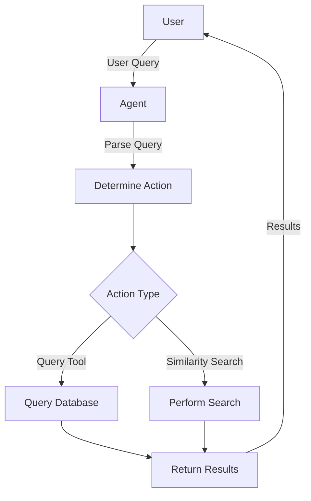

# 🎉Salses Llama 🚀

Welcome to the **Sales Llama**! This project demonstrates a powerful AI-driven agent designed to assist with querying and exploring a product knowledge graph. Leveraging the capabilities of LangChain, Neo4j, and advanced embeddings, this agent provides intelligent and context-aware product recommendations.

## 🌟 Features

- **Graph Database Integration**: Utilizes Neo4j for storing and querying product data.
- **Embedding Search**: Employs HuggingFace embeddings for similarity search.
- **AI-Powered Queries**: Uses Groq and LangChain to interpret user queries and generate Cypher queries.
- **Dynamic Interaction**: Offers an engaging and user-friendly interaction model for finding products.

## 📋 Project Structure

Here's a breakdown of the key components in this project:

1. **Data Insertion**: Inserts product data into the Neo4j graph database.
2. **Vector Index Creation**: Creates vector indices for efficient similarity searches.
3. **Query Generation**: Constructs Cypher queries based on user inputs.
4. **Similarity Search**: Performs cosine similarity search to find matching products.
5. **Agent Interaction**: Facilitates a seamless interaction between the user and the agent.

## 📚 How to Use

1. **Set Up Environment Variables**:
   ```sh
   export GROQ_API_KEY="your_groq_api_key"
   ```

2. **Run the Script**:
   ```python
   python main.py
   ```

3. **Interact with the Agent**:
   - Provide a prompt like "I'm searching for pink shirts."
   - The agent will intelligently interpret your query and return the best matching products.

## 🛠️ Installation

1. **Clone the Repository**:
   ```sh
   git clone https://github.com/yourusername/amazon-product-kg-agent.git
   cd amazon-product-kg-agent
   ```

2. **Install Dependencies**:
   ```sh
   pip install -r requirements.txt
   ```

3. **Configure Neo4j**:
   Ensure you have a running Neo4j instance and update the connection details in the script.

## 💡 Examples

### Querying the Database
```python
prompt1 = "I'm searching for pink shirts"
agent_interaction(prompt1)

prompt2 = "Can you help me find toys for my niece, she's 8"
agent_interaction(prompt2)

prompt3 = "I'm looking for nice curtains"
agent_interaction(prompt3)
```

### Sample Output
```
Final Answer: 
- Pink Shirt (Product ID: 12345)
- Baby Pink Shirt (Product ID: 67890)
```

## 📊 Flowchart



## 🎯 Goals

- **Efficiency**: Minimize resource utilization and response time.
- **Accuracy**: Provide the most relevant product recommendations.
- **User Engagement**: Ensure a seamless and intuitive interaction experience.

## 👥 Contributions

We welcome contributions from the community! Feel free to open issues or submit pull requests. 

## 📝 License

This project is licensed under the MIT License. See the [LICENSE](LICENSE) file for details.

## 🙏 Acknowledgements

- **LangChain** for their powerful language model framework.
- **Neo4j** for their robust graph database.
- **HuggingFace** for their state-of-the-art embeddings.
